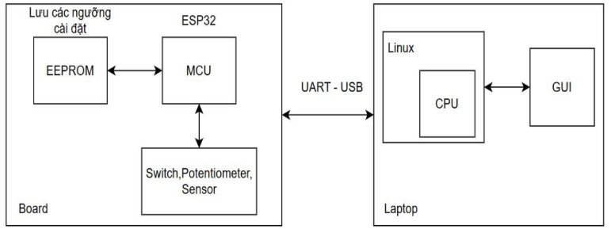
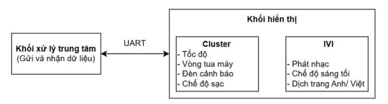
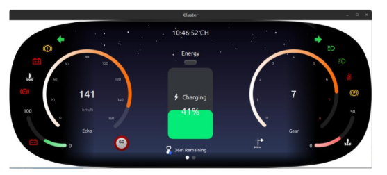
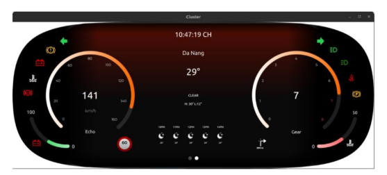
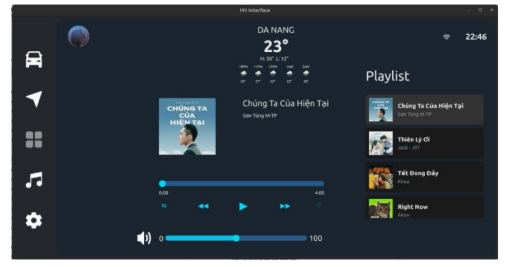
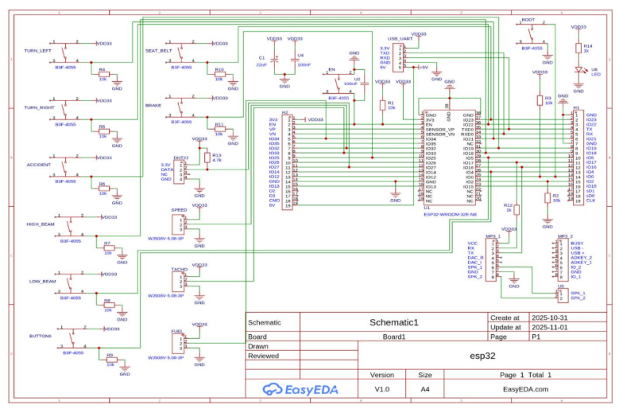
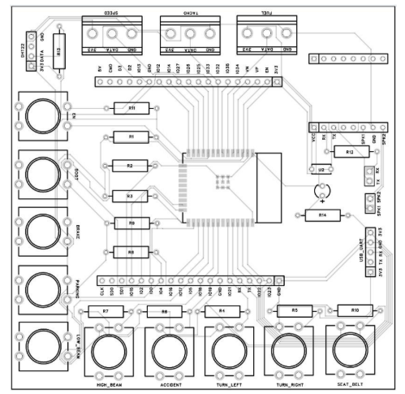

# Thiết kế và Xây dựng Hệ thống HMI cho Ô tô sử dụng ESP32 và QML

## Giới thiệu

Đề tài xây dựng mô hình mô phỏng **HMI (Human–Machine Interface)** trên xe ô tô, bao gồm hai thành phần chính:

- **Cluster** – bảng đồng hồ trung tâm hiển thị tốc độ, vòng tua động cơ và các đèn cảnh báo.
- **IVI (In-Vehicle Infotainment)** – màn hình giải trí trung tâm với chức năng phát nhạc và cài đặt.

Phần cứng sử dụng **ESP32** kết hợp nút nhấn, biến trở và cảm biến DHT22; giao tiếp với phần mềm trên PC qua **UART Serial**. Giao diện được xây dựng bằng **Qt/QML** với C++ làm backend xử lý logic và truyền thông.

---

## Tính năng

### Màn hình Cluster
- Đồng hồ tốc độ dạng gauge (0–160 km/h)
- Đồng hồ vòng tua máy (0–8 RPM)
- Nhóm đèn cảnh báo: xi-nhan, đèn pha, ABS, check-engine, phanh, dây an toàn...
- Hiển thị mức pin / nhiên liệu
- Hiển thị nhiệt độ môi trường từ cảm biến DHT22
- Đồng hồ thời gian thực
- Cập nhật dữ liệu real-time từ ESP32

### Màn hình IVI
- Phát nhạc từ thẻ nhớ qua module DFPlayer Mini
- Điều khiển Play / Pause / Next / Previous
- Hiển thị tên bài hát, số track, tiến trình phát
- Danh sách phát (Playlist)
- Thanh điều chỉnh âm lượng
- Cài đặt chế độ sáng / tối (Light/Dark mode)
- Hỗ trợ đa ngôn ngữ (Anh / Việt)

### Phần cứng ESP32
- Nút nhấn vật lý mô phỏng: xi-nhan trái/phải, đèn pha, phanh, dây an toàn
- Biến trở điều chỉnh tốc độ và RPM
- Cảm biến DHT22 đo nhiệt độ và độ ẩm
- Giao tiếp UART tốc độ 115200 bps
- Lưu cài đặt ngôn ngữ và theme vào EEPROM

---

## Kiến trúc hệ thống

### Sơ đồ khối

<p align="center">
  <!-- Thêm ảnh sơ đồ khối hệ thống (Hình 3.1 trong báo cáo) -->
  
  <br/>
  <em>Mô hình hệ thống</em>
</p>

<p align="center">
  <!-- Thêm ảnh sơ đồ khối hệ thống (Hình 3.1 trong báo cáo) -->
  
  <br/>
  <em>Sơ đồ khối hệ thống</em>
</p>

### Tương tác C++ ↔ QML

Hệ thống sử dụng cơ chế **Signal–Slot** và **Q_PROPERTY** của Qt để đồng bộ dữ liệu giữa C++ và giao diện QML:

- `setContextProperty` – chia sẻ object C++ (SerialManager, MediaController) cho toàn bộ QML.
- `Q_PROPERTY` + `NOTIFY` – giao diện tự động cập nhật khi dữ liệu thay đổi.
- `Q_INVOKABLE` – QML gọi trực tiếp hàm C++ để gửi lệnh xuống ESP32.

### Giao thức Serial

Dữ liệu truyền theo định dạng JSON:

```json
// ESP32 → PC
{"speed":85,"rpm":3200,"temp":29,"humid":65,
 "turn_left":0,"turn_right":1,"high_beam":0,"brake":0,"fuel":41}

// PC → ESP32
{"cmd":"play","track":2}
{"cmd":"next"}
{"cmd":"volume","val":80}
```

---

## Công nghệ và linh kiện

### Phần mềm

| Công nghệ | Mô tả |
|---|---|
| Qt 6 / QML | Framework GUI đa nền tảng |
| QSerialPort | Giao tiếp Serial giữa PC và ESP32 |
| C++17 | Backend logic, xử lý dữ liệu |
| Arduino IDE | Lập trình firmware cho ESP32 |
| EasyEDA | Thiết kế sơ đồ nguyên lý và PCB |
| Git | Quản lý phiên bản mã nguồn |

### Phần cứng

| Linh kiện | Thông số |
|---|---|
| ESP32-WROOM-32E | Xtensa LX6 dual-core 240 MHz, Wi-Fi + BLE, 448KB ROM, 520KB SRAM |
| USB–UART CP2102 | Silicon Labs, tốc độ tối đa 921600 bps, hỗ trợ Windows/Linux/macOS |
| DFPlayer Mini (MP3-TF-16P) | Giải mã MP3/WAV/WMA, hỗ trợ thẻ TF, FAT16/FAT32 |
| Cảm biến DHT22 | Nhiệt độ ±0.5°C, độ ẩm ±2% RH, nguồn 3.3–6V |

---

## Giao diện

### Màn hình Cluster

<p align="center">
  <!-- Thêm ảnh sơ đồ khối hệ thống (Hình 3.1 trong báo cáo) -->
  
  <br/>
  <em>Màn hình Cluster 1</em>
</p>

<p align="center">
  <!-- Thêm ảnh sơ đồ khối hệ thống (Hình 3.1 trong báo cáo) -->
  
  <br/>
  <em>Màn hình Cluster 2</em>
</p>

### Màn hình IVI

<p align="center">
  <!-- Thêm ảnh sơ đồ khối hệ thống (Hình 3.1 trong báo cáo) -->
  
  <br/>
  <em>Màn hình IVI</em>
</p>

### Sơ đồ nguyên lý và PCB

<p align="center">
  <!-- Thêm ảnh sơ đồ khối hệ thống (Hình 3.1 trong báo cáo) -->
  
  <br/>
  <em>Sơ đồ mạch nguyên lý</em>
</p>

<p align="center">
  <!-- Thêm ảnh sơ đồ khối hệ thống (Hình 3.1 trong báo cáo) -->
  
  <br/>
  <em>Thiết kế PCB</em>
</p>
---

## Cài đặt và chạy thử

### Yêu cầu

- Qt 6.2+ với module `QtSerialPort` và `QtQuick`
- Arduino IDE 2.x + ESP32 board package (Espressif)
- Driver CP210x (Silicon Labs)
- OS: Linux / Windows 10+ / macOS

### Nạp firmware ESP32

1. Kết nối ESP32 với máy tính qua cáp USB–UART CP2102.
2. Mở thư mục `firmware/esp32/` bằng Arduino IDE.
3. Chọn board **ESP32 Dev Module** và cổng COM tương ứng.
4. Nhấn **Upload** để nạp chương trình.

### Build và chạy ứng dụng Qt

```bash
# Clone repository
git clone https://github.com/NgocCa2506/HMI-Automotive.git
cd HMI-Automotive

# Build bằng Qt Creator (khuyến nghị)
# Hoặc build bằng command line:
mkdir build && cd build
cmake .. -DCMAKE_PREFIX_PATH=/path/to/Qt6
cmake --build . --parallel

# Chạy ứng dụng
./HMI_Automotive
```

---

## Kết quả kiểm thử

### Giao diện Cluster

| # | Chức năng | Mô tả | Kết quả |
|---|---|---|---|
| 1 | Hiển thị tốc độ | ESP32 gửi Speed 0 → 160 km/h | ✅ Gauge cập nhật mượt, không giật |
| 2 | Hiển thị vòng tua | ESP32 gửi 0 → 8 RPM | ✅ Kim quét chính xác |
| 3 | Đèn cảnh báo | Thao tác nút tương ứng trên ESP32 | ✅ Icon bật/tắt đúng trạng thái |
| 4 | Cập nhật realtime | Gửi dữ liệu tốc độ liên tục | ✅ UI phản hồi tức thì |

### Giao diện IVI

| # | Chức năng | Mô tả | Kết quả |
|---|---|---|---|
| 1 | Play / Pause | Nhấn nút IVI hoặc ESP32 | ✅ UI và phần cứng đồng bộ |
| 2 | Chuyển bài | Nhấn Next / Previous | ✅ DFPlayer đổi bài chính xác |
| 3 | Hiển thị tên bài | Gửi số track từ ESP32 | ✅ Tên bài cập nhật đúng |
| 4 | Trạng thái phát | Gửi playing/paused từ ESP32 | ✅ Icon và text đổi đúng trạng thái |
| 5 | Tương tác 2 chiều | QML gửi lệnh xuống ESP32 | ✅ ESP32 xử lý và phản hồi đúng |

### Phần cứng ESP32

| # | Chức năng | Mô tả | Kết quả |
|---|---|---|---|
| 1 | Đọc button | Nhấn từng nút mô phỏng | ✅ Không bị double-click |
| 2 | Gửi dữ liệu Serial | Quét tốc độ, RPM, icon | ✅ Chuỗi gửi đúng format |
| 3 | Nhận lệnh từ PC | Điều khiển nhạc từ QML | ✅ ESP32 xử lý đúng |
| 4 | Ổn định đường truyền | Serial 115200 bps | ✅ Không mất gói dữ liệu |

---

## Hạn chế và hướng phát triển

### Hạn chế hiện tại

- Hệ thống mới ở mức mô phỏng, chưa triển khai trên phần cứng HMI thực tế của ô tô.
- Dữ liệu tốc độ và vòng tua được mô phỏng qua nút nhấn, chưa lấy từ cảm biến thực hoặc mạng CAN.
- Chức năng IVI mới hỗ trợ phát nhạc cơ bản, chưa có GPS, Bluetooth, kết nối điện thoại.
- Giao diện chưa được tối ưu theo tiêu chuẩn thiết kế HMI công nghiệp trong ô tô.

### Hướng phát triển

- Tích hợp **CAN Bus** để lấy dữ liệu thực từ các module ECU.
- Mở rộng IVI với Bluetooth, Wi-Fi, định vị GPS và điều khiển giọng nói.
- Triển khai trên màn hình HMI thực tế thay vì mô phỏng trên máy tính.
- Nâng cấp giao diện theo chuẩn HMI công nghiệp ô tô.
- Nghiên cứu ứng dụng trên các nền tảng nhúng khác (Raspberry Pi, i.MX6…).

---

## Tác giả

| Vai trò | Tên |
|---|---|
| Sinh viên | Nguyễn Ngọc Ca |

**Trường:** Đại học Công nghệ Thông tin và Truyền thông Việt Hàn (VKU)  
**Khoa:** Kỹ thuật Máy tính và Điện tử  
**Địa chỉ:** Đà Nẵng, Việt Nam

---

## Tài liệu tham khảo

1. Qt Company. *Qt Documentation*. https://doc.qt.io
2. Qt Company. *QML Application Development Guide*. https://qmlbook.github.io
3. Espressif Systems. *ESP32 Series Datasheet & Technical Reference*. https://www.espressif.com
4. Silicon Labs. *CP2102 USB-to-UART Bridge Controller*. https://www.silabs.com
5. DFRobot. *DFPlayer Mini / MP3-TF-16P Module Documentation*. https://wiki.dfrobot.com
6. Aosong Electronics. *AM2302 / DHT22 Datasheet*. https://www.aosong.com
7. The Qt Company. *QSerialPort – Qt Serial Communication Module*. https://doc.qt.io/qt-6/qserialport.html